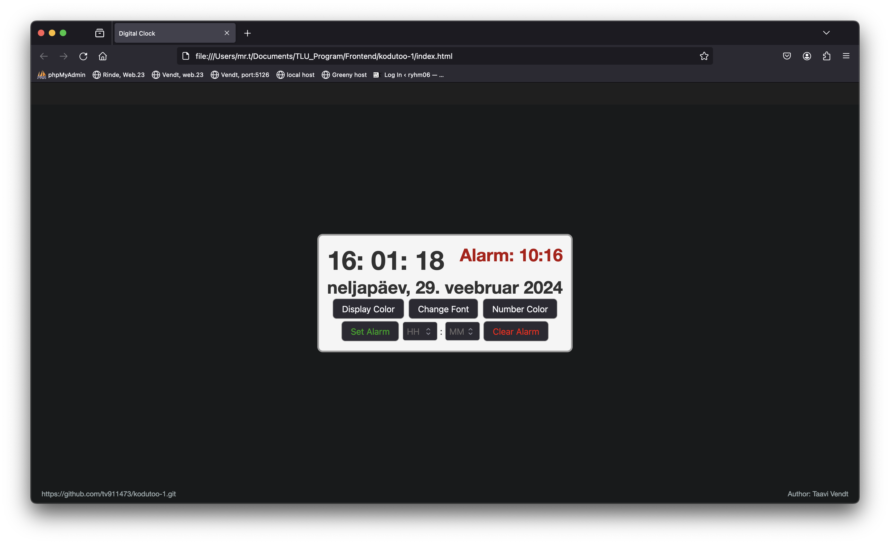

Autor: Taavi_Vendt

Funktsionaalsused:
* Suurust saab muuta "+" ja "-" klahvidega (määratud on miinumum ja maximum suurus)
* Nupud:
    - Display Color: muudab taustavärvi (random color)
    - Change Font: muudab fonti ('Helvetica Neue', 'Times New Roman', 'Courier New', 'Verdana')
    - Number Color: muudab fonti värvi (random color)
    - Set Alarm: seab äratuse aja
    - Clear Alarm: kustutab äratuse aja
* Äratuse seadistamine:
    - kasutaja valib tunnid ja minutid äratuseks (alumine keskmine väli)
    - äratuse seadistamiseks vajutada Set Alarm
    - äratuse kustutamiseks vajutada Clear Alarm
* Äratuse aktiveerumisel antakse kasutajala sellest teada alert boxiga