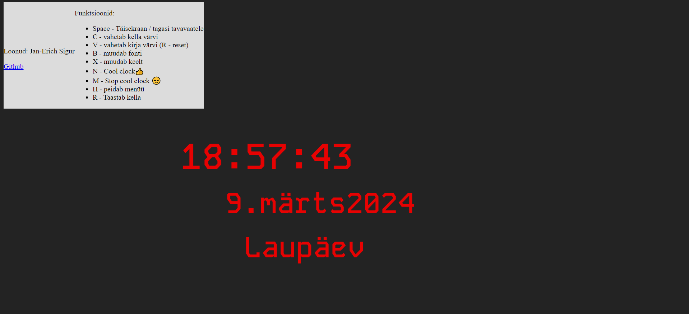
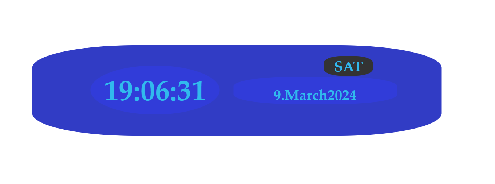
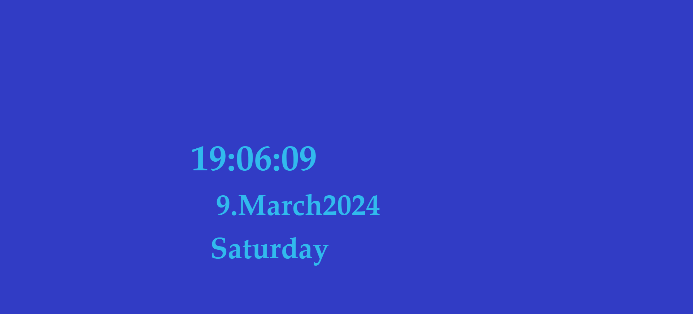

# kodutoo-1

Eesrakenduse kodutöö Jan-Erich Sigur

## Pildid

Väike originaalkujul kell

Täisekraanil kell (originaalkujul)

Väike muudetud kell

Täisekraanil muudetud kell

## Funktsionaalsus

Kell näitab aega, kuupäeva ning nädalapäeva.

Kellal saab (kasutades klaviatuuriklahve) muuta erinevaid omadusi.

- Muuta kella värvi.
- Muuta kella kirjatüüpi.
- Muuta kella kirja värvi.
- Muuta kella värvi "hingavaks"
- Muuta kella keelt
- Muuta kella kujundust, kas "digitaalseks kellaks" või "ekraanisäästjaks"
- Lisaks on võimalik kell taastada originaalkujule.
