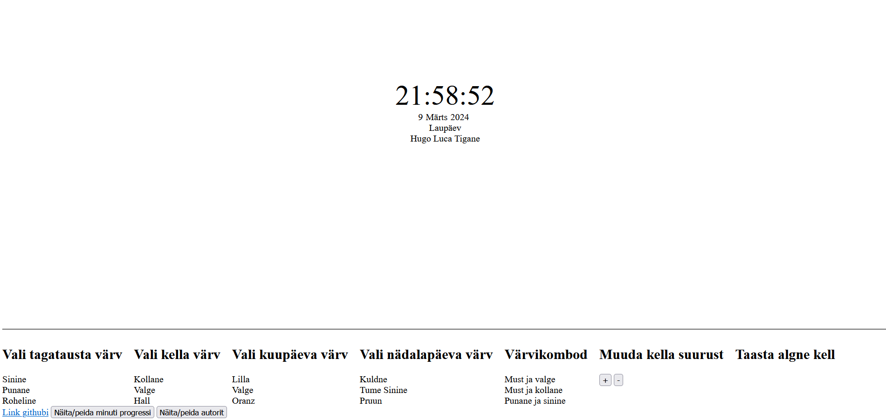

# kodutoo-1
Õppeaine: eesrakendused
Kodutöö nimi: kell
Teostaja: Mait Rungi
Juhendaja: Tauri Kirsipuu

## Ekraanipilt rakendusest

## Funktsionaalsus

1. Veebirakendus näitab kella, kuupäeva, nädalapäeva ja aastat.
1. Muudetavad kella atribuudid
    1. Kellaaja fondi suurendamine '+' klahviga
    1. Kellaaja fondi vähendamine '-' klahviga
    1. Kellaaja liigutamine brauseris nooleklahvidega (kellaaja liikumisel üle serva ilmub kellaaeg vastassuunast)
    1. Tunni, minuti ja/või sekundi fondi vähendamine vasakpoolse hiire klikiga
    1. Tunni, minuti ja/või sekundi taustavärvi muutmine vasakpoolse hiire klikiga
    1. Tunni, minuti ja/või sekdundi suurendamine parempoolse hiire klikiga
    1. Öö ja päeva reziimi muutmine nupule vajutades (öine vaade mahedam, päevane erksam)
    1. Kuu ja nädalapäeva keele muutmine drop-down menüü abil
1. Kella välimuse mitmed atribuudid on muudetavad kasutaja tegevuse tulemusena (suurus, värvus juhuslikult)
1. Rakendus asub aadressil https://www.tlu.ee/~maru/Eesrakenduste_arendamine/kodutoo1/clock.html
1. Rakendus asub githubis maitrungi/Eesrakendused-2024/kodutoo-1
