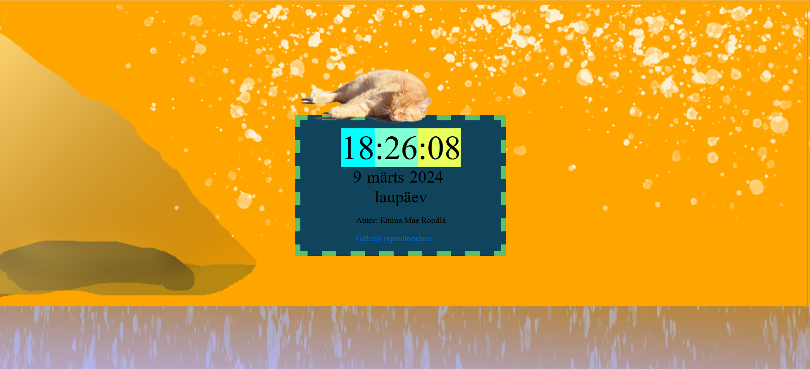

# kodutoo-1
Esimene kodutöö

## Veebirakenduse omadused

1. Näitab kella, kuupäeva, nädalapäeva ja aastat.
2. Kella taustavärvi on võimalik muuta kella peale klõpsates.
3. Terve veebilehe värvi on võimalik muuta ekraani peale vajutades.
4. Pannes hiire kassi peale hakkab kass nurruma.
5. "+" nupuga saab muuta kella teksti suuremaks.
6. "-" nupuga saab muuta kella teksti väiksemaks.
7. Pildid ekraani peal muutuvad sõltuvalt kellaajast.

* Päeval (kell 10-20) on default ekraan selline:

* Öösel selline:

Autor: Emma Mae Roodla